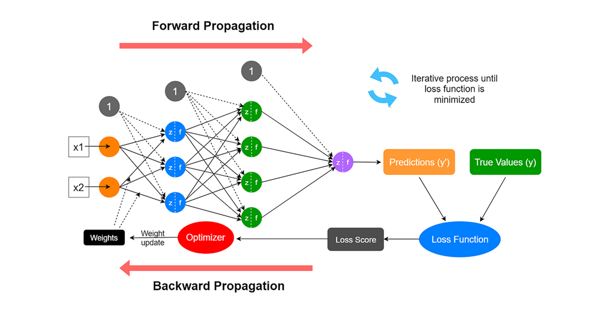

# Neural Network

This project is a **learning implementation** of a simple neural network built completely **from scratch using NumPy**.
It’s designed to help understand the internal workings of neural networks including forward propagation, backward propagation, and gradient descent **without using frameworks like TensorFlow or PyTorch**.



---

## Structure 

```
neural_network/
│
├─ activations.py # Activation functions and their derivatives 
├─ layers.py # Layer class (forward & backward propagation)
├─ losses.py # Loss functions (binary cross-entropy, MSE) and derivatives
├─ NeuralNetwork.py # NeuralNetwork class with train, predict, evaluate, summary
```

---

## Features 

- Fully connected (dense) layers
- Multiple activations: `relu`, `sigmoid`, `tanh`, `linear`
- Loss functions: `binary_cross_entropy`, `mse`
- Forward and backward propagation
- Train, predict, evaluate functions
- Weight initialization:
  - He for ReLU
  - Xavier for Sigmoid/Tanh
  - Small weights for Linear

---

## Usage

```python
from neural_network import NeuralNetwork
import numpy as np

# Example: Binary Classification
X = np.random.randn(10, 100)      # 10 features, 100 samples
Y = np.random.randint(0, 2, (1, 100))

nn = NeuralNetwork(
    layers_dims=[X.shape[0], 64, 32, 1],
    activations=['relu', 'relu', 'sigmoid'],
    loss='binary_cross_entropy'
)

nn.train(X, Y, epochs=500, lr=0.01)
loss, acc = nn.evaluate(X, Y)
print(f"Loss: {loss}, Accuracy: {acc}")
```
---

## Possible Extensions

- Add new activation functions (e.g., LeakyReLU, Softmax)
- Add regularization (L2, dropout)
- Add new loss functions to losses.py
- Implement mini-batch gradient descent
- Add momentum or Adam optimizer
- Plot training loss over time

If you implement improvements or new features, feel free to:
1. Fork this repository
2. Create a new branch for your feature
3. Submit a Pull Request to share your work with others 

Your contributions are always welcome